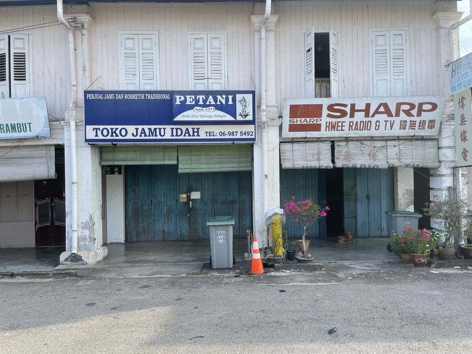

저는 취미가 하나게 있어요. 그 취미가 사진 찍을 것이에요. 내가 왜 이렇게 사진 찍는 것을 좋아할가? 사진는 저한테를 아주 특별한 것입니다. 제 제일 좋아하는 이유는 느낌, 날씨, 기온 또 추억을 기록 할 수 있어. 그래서, 어디든 갈 때마다 사진을 꼭 찍을게요. 사진 찍고 어떻게 나오든 삭제 안했어요.

저 핸드폰의 사진 겔러리 안에서 2021년부터 지금까지의 사진이 있어요. 재미있는 사진을 생각보다 많아요. 모든 공유하고 싶지만 지금 아직 못 했어요. 제 사진 찍을 대상은 건물, 경치, 고양이, 음식 뜽뜽 다 있어요. 아쉽지만, 저는 사람이 대해서 사진 별로 안 찍어요. 왜냐하면, 사람들 모두보다 재미 없어서.

저는 방금 핸드폰 갤러리를 스크롤하고 있을 때 이 사진을 너무 좋아한다고 생각해. 이 사진을 2022 년 6월 여행가서 찍은 사진이에요. 정확하게 말하면 집에 돌아오는 길에 찍은 사진이에요. 이 사진 찍은 위치는 Johor 주의 작은 마을 Parit Jawa 이에요. 이 마을은 Muar 근처에 있어요. 여행밴 안에서 신호등을 기다리며 사진을 찍었습니다. 그 타이밍이 완벽했고 사진이 정말 멋졌습니다.

사진 안에서 오랜된 건물이 있어요. 상가가 세 채 있어요. 윈쪽 상가는 구식 이발소입니다. 입구에서 희귀한 살룬문이 있어요. 간판이 너무 낡아서 가게 이름을 알아볼 수 없어요. 그 이발소에 머리를 새로 자르는 것을 상상할 수 있습니까? 너무 시원해잖아요.

그 다음에 중앙에는 허브와 전통 화장품을 판매하는 가게가 있습니다. 가게 이름은 "Toko Jamu Idah" 입니다. 간판에 "sejak 1972"라는 글이 있습니다. 1972년부터라는 뜻입니다. 이 가게들 이미 반 세기가 넘게 존재했습니다. 진짜 대박입니다. 하지만 가게가 폐쇄되었고 아직 영업 중인지 모르겠어요. 그 사진 찍은 날 주말이에요? 몰라, 기억이 안 나요.

마지막 가게는 오래된 TV와 라디오 서비스 가게입니다. 이름은 "Hwee Radio & TV 偉無線電" 입니다. 이건 가게는 지금은 별로 없어요. 그 시대의 사람들이 여전히 방사광 TV랑 라디오를 오락을 위해 사용하고 있었습니다. 문이 조금 열려 있는데, 주인이 안에 있는 것 같네요? 게다가, 문 옆에 강아지가 누워 있어요. 그 강아지는 나이가 먹어 보이고 활기가 없어서, 조금 슬퍼지네요. 이제 두 해가 지났는데, 강아지와 주인이 잘 지내고 있기를 바랍니다.

아까 "Toko Jamu Idah"를 검색해봤는데 가게의 정확한 위치를 찾았습니다. 너무 행복해요. [이것은](https://www.google.com/maps/place/Toko+Jamu+Idah/@1.9583818,101.3254743,8z/data=!4m10!1m2!2m1!1stoko+jamu+idah!3m6!1s0x31d1b1430182b235:0xe7e5595f27d30bfd!8m2!3d1.9583818!4d102.6438337!15sCg50b2tvIGphbXUgaWRhaFoQIg50b2tvIGphbXUgaWRhaJIBFGhvbWVvcGF0aGljX3BoYXJtYWN54AEA!16s%2Fg%2F11ffw4bwrl?entry=ttu) 구글 지도 링크입니다. 다른 날에도, 그 곳은 다시 방문 하고 싶어요.

이제는 여기까지입니다. 이것을 바탕으로 "사진과 글"이라는 시리즈를 사작하고 싶습니다. 너무 많이 기대해 주세요.
